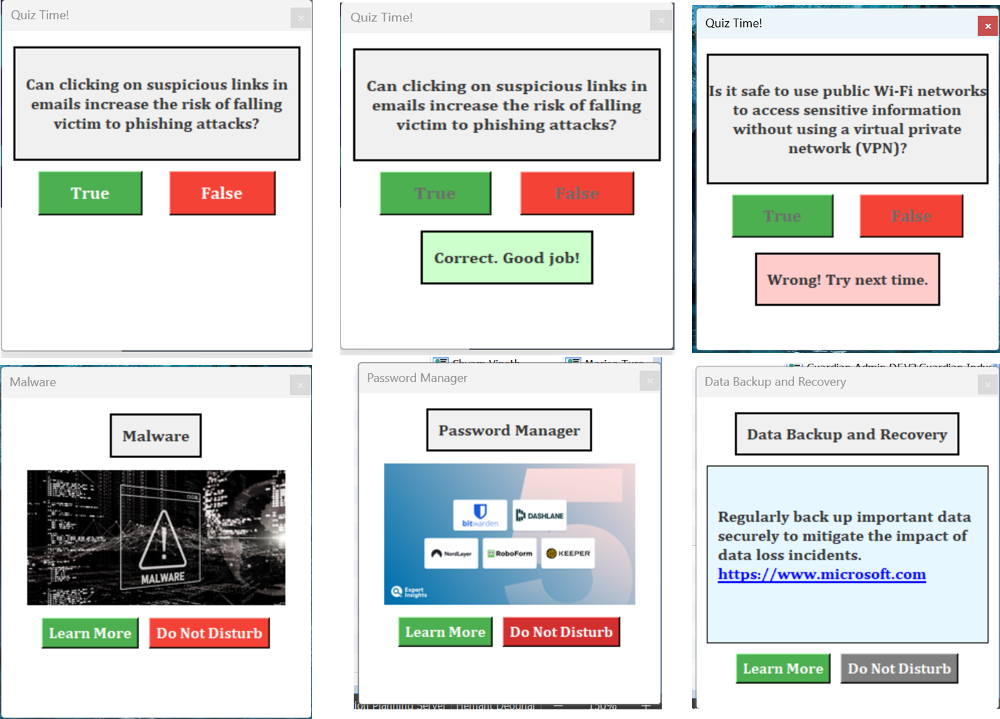

# Tune AI PyCon India 2024 Contest

## Cyber Security Awareness via interactive popups
> The app includes features like : Interactive Quiz, Visual Notification, Do Not Disturb, 'Learn More' , etc.
 
### cyber.py

This is the client side or the user application which will display popup notification on cybersecurity best practices. The app conects to MongoDb and fetches quiz and image from the collection and displays prompts. The prompts are non-intrusive. The frequency can be configured and it also has do not disturb feature inbuilt. 

### mongoup.py

This code updates the MongoDB using tune studio. It updates the quiz collection with new quiz every 3 minutes(timing can be changed).
## Tune AI Products Used (Required)
- [x] Tune Studio
- [ ] Tune Chat
- [ ] Tune Assisants

## Checklist
- [x] Includes a README
- [x] Includes instructions on how to run the app

## Screenshots (Optional)

