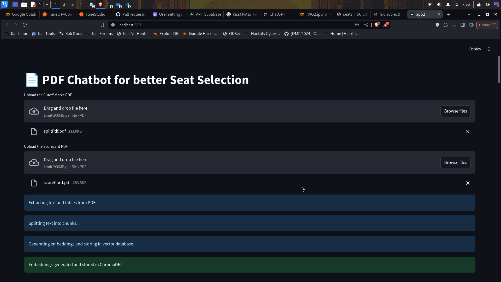
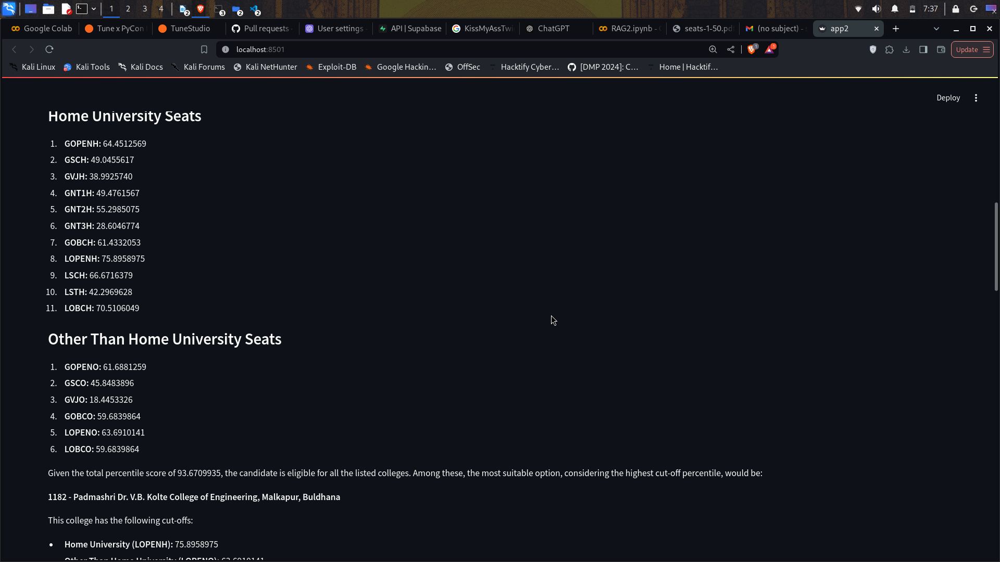

# 📄 UniFriend: PDF Chatbot for better Seat Selection(v0.0.1)

This project is a full-stack Python application that allows users to interact with PDF documents— score card, seat matrix pdf and merit cuoff pdf —through a chat interface. The application leverages open-source technologies and integrates with advanced language models to provide insightful, conversational responses based on the content of uploaded PDFs.

## Why this problem statement 
Recently my brother took admission in FE Engg. During his CAP rounds (MHT-CET 2024) we faced a lot of issues in seat selection. There were 6 pdfs of 2000+ pages each, by the end of round CAP round 3. 3 pdfs had seat matrix information, other 3 had merit cut-offs for the seats which seems very overwhelming for parents as well as students to crosscheck their rank against seat availability. This is a small effort to create such application to help next generation in finding their suitable match.


## Current Version :  v0.0.1
The current application is capable of taking 2 pdf as input and answer questions based on the comparison. basically analyse the score card and suggest college according to score.

## Next Steps :
- v0.0.2 will have more efficient parsing marsheet/score card and cutoff pdf to find the suitable seat for candidate 
- v0.0.3 will have capabilities of comparing 3 seat matrix pdfs, 3 cutoff matrix pdf and score card 

## 🎯 Main Features

- **PDF Upload**: Users can upload PDF files directly through the web interface.
- **Text and Table Extraction**: The app extracts text and tables from the uploaded PDFs, handling complex documents with tabular data.
- **Data Processing**: Extracted content is processed and split into manageable chunks for embedding generation.
- **Embeddings Generation**: Utilizes Google's Generative AI Embeddings to convert text chunks into embeddings.
- **Vector Database Storage**: Embeddings are stored in ChromaDB, an open-source vector database for efficient similarity search.
- **Chat Interface**: Users can interact with the PDF content via a chat interface, asking questions and receiving answers generated by a language model.
- **Language Model Integration**: Integrates with a specified OpenAI model to generate human-like responses based on the PDF content.

## 🛠️ Technologies Used

- **[Streamlit](https://streamlit.io/)**: Web application framework for creating interactive frontend interfaces.
- **[LangChain](https://langchain.readthedocs.io/)**: Framework for developing applications powered by language models.
- **[ChromaDB](https://www.trychroma.com/)**: Open-source embedding database for storing and querying vector embeddings.
- **[PyPDFLoader (LangChain)](https://langchain.readthedocs.io/en/latest/modules/document_loaders/examples/pdf.html)**: Utility for extracting text from PDF documents.
- **[tabula-py](https://tabula-py.readthedocs.io/en/latest/)**: Python wrapper for Tabula, enabling extraction of tables from PDFs.
- **[Pandas](https://pandas.pydata.org/)**: Data manipulation and analysis library, used here for handling tabular data.
- **[GoogleGenerativeAIEmbeddings](https://github.com/hwchase17/langchain/blob/master/libs/langchain/langchain/embeddings/google_palm.py)**: Generates embeddings using Google's embedding models.
- **[ChatOpenAI (LangChain)](https://langchain.readthedocs.io/en/latest/modules/models/chat/integrations/openai.html)**: Interface to interact with OpenAI's chat models.
- **[Python Dotenv](https://pypi.org/project/python-dotenv/)**: Facilitates the use of environment variables from a `.env` file.


## Glimpse 






## 🚀 Getting Started

### Prerequisites

- **Python 3.7+**
- **Java**: Required by `tabula-py` for table extraction.
  - Install from [Java Downloads](https://www.java.com/en/download/) and ensure it's added to your system's PATH.
- **Tune Studio API Key**: Sign up at [TuneStudio](https://studio.tune.app/playground) to obtain an API key.
- **Google API Key**: Required for Google's Generative AI Embeddings.

### Installation Steps

1. **Clone the Repository** (yet to init. this repo)

   ```bash
   git clone https://github.com/yourusername/pdf-chatbot.git
   cd pdf-chatbot
   ```

2. **Create a Virtual Environment (Optional but Recommended)**

   ```bash
   python -m venv venv
   source venv/bin/activate  # On Windows use `venv\Scripts\activate`
   ```

3. **Install Dependencies**

   ```bash
   pip install -r requirements.txt
   ```

   If a `requirements.txt` file is not provided, install the dependencies manually:

   ```bash
   pip install streamlit langchain chromadb PyPDF2 tabula-py pandas tiktoken python-dotenv openai pypdf
   ```

   Additionally, install the Google Generative AI Embeddings library:

   ```bash
   pip install langchain-google-genai
   ```

4. **Set Up Environment Variables**

   Create a `.env` file in the project root directory and add your API keys:

   ```env
   TUNE_API_KEY=your-tune-api-key
   GOOGLE_API_KEY=your-google-api-key
   ```

   Replace `your-tune-api-key` and `your-google-api-key` with your actual API keys.

5. **Run the Application**

   ```bash
   streamlit run app.py
   ```

### Usage

- **Access the App**: Open your web browser and navigate to `http://localhost:8501` (or the URL provided in the terminal).
- **Upload a PDF**: Click on the **"Upload a PDF file"** button and select a PDF document from your computer.
- **Wait for Processing**:
  - **Extracting Text**: The app will extract text from your PDF.
  - **Extracting Tables**: Tables within the PDF are extracted and processed.
  - **Generating Embeddings**: Text and tables are converted into embeddings and stored in ChromaDB.
- **Interact via Chat**:
  - Use the chat interface to ask questions about the content of your PDF.
  - The application will generate responses based on the information extracted from your document.
- **View Responses**: The assistant's answers will be displayed below the chat input.

## ⚙️ How It Works

1. **File Upload and Saving**: The user uploads a PDF file, which is saved temporarily for processing.

2. **Extraction**:
   - **Text Extraction**: Text content is extracted from the PDF using `PyPDFLoader`.
   - **Table Extraction**: Tables are extracted using `tabula-py` and converted into CSV text format.

3. **Document Preparation**: Extracted text and tables are encapsulated into `Document` objects provided by LangChain.

4. **Text Splitting**: The documents are split into smaller chunks using `RecursiveCharacterTextSplitter` to optimize embedding generation and similarity search.

5. **Embeddings Generation**:
   - Utilizes `GoogleGenerativeAIEmbeddings` to generate embeddings for each text chunk.
   - Embeddings capture the semantic meaning of the text, enabling effective similarity searches.

6. **Vector Storage with ChromaDB**:
   - Generated embeddings are stored in ChromaDB, a vector database that allows for efficient retrieval based on vector similarity.

7. **Chat Interaction**:
   - When a user inputs a question, the application performs a similarity search in ChromaDB to find relevant document chunks.
   - The relevant context is compiled and fed into the prompt for the language model.
   - `ChatOpenAI` generates a response using the specified OpenAI model.

8. **Response Display**: The assistant's answer is presented to the user, providing insights based on the content of the uploaded PDF.

## 📚 Dependencies and Libraries

- **Language Models and Embeddings**:
  - `langchain`
  - `langchain-google-genai`
- **Data Processing and Extraction**:
  - `PyPDF2`
  - `tabula-py`
  - `pandas`
- **Web Application**:
  - `streamlit`
  - `python-dotenv`
- **Vector Database**:
  - `chromadb`
- **Others**:
  - `tiktoken`: For tokenization processes within language models.

## 📝 Notes

- **Java Installation**: Ensure that Java is installed and properly configured, as it is required by `tabula-py` for table extraction.
- **API Keys Safety**: Keep your API keys secure and do not expose them publicly.
- **Data Privacy**: Be cautious with sensitive documents, as uploading them to the application will process and temporarily store their content.
- **ChromaDB Persistence**: Embeddings are stored in the `./chroma_db` directory. To clear stored embeddings, you can delete this directory.

## 🐛 Troubleshooting

- **Table Extraction Issues**: If tables are not being extracted properly, verify that Java is installed and consider adjusting `tabula-py` settings or using alternative libraries like `camelot-py`.
- **Module Errors**: Ensure all dependencies are installed. If you encounter a `ModuleNotFoundError`, install the missing library using `pip`.
- **API Errors**: Verify that your API keys are correct and have the necessary permissions. Check your internet connection if API requests fail.
