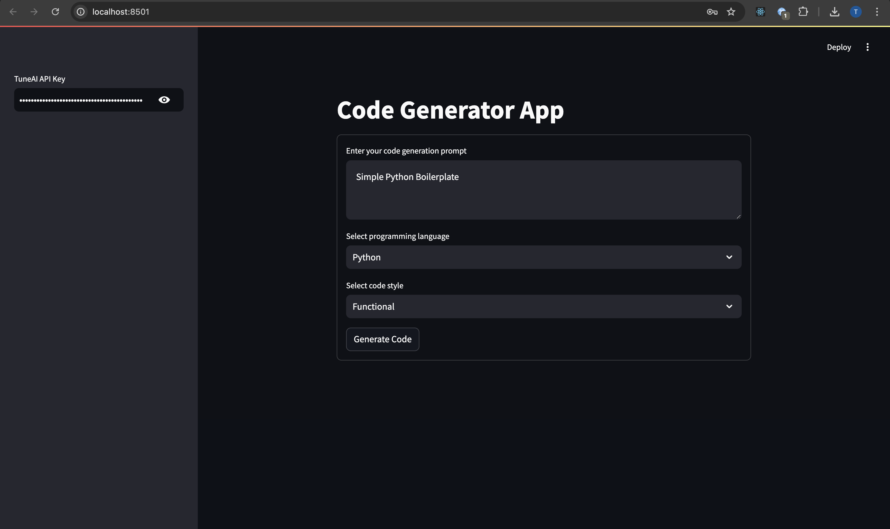
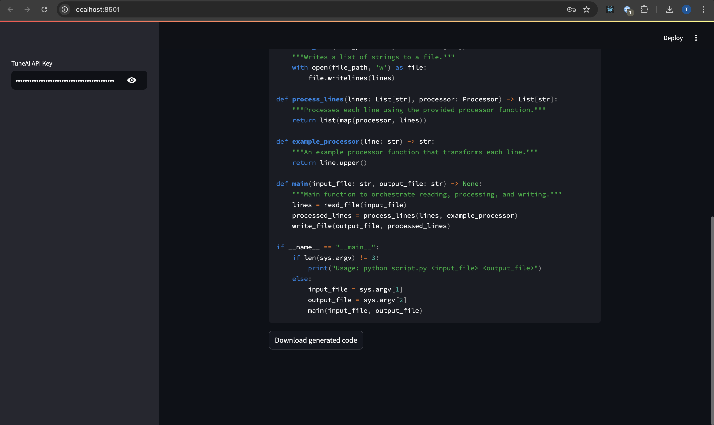

# Code Generator App using Tune Studio and Streamlit

This repository contains the code for building a code generator app that uses Tune Studio to integrate LangChain with the Open AI API and Streamlit for the front end. The languages supported right now are Python, Java, JavaScript, C++ and Haskell.



## Running the application

Clone this repository and navigate to the `community/code_generator-app` folder. In this folder, run the following command to create a virtual environment: 

```sh
python -m venv venv
```

Activate the virtual environment with the following command: 

```sh
source venv/bin/activate
```

Inside the virtual environment, install the required dependencies: 

```sh
pip install langchain langchain-openai streamlit
```

Start the app by running the following command: 

```sh
streamlit run app.py
```

The StreamLit app will launch in your browser. You can now enter your Tune AI Studio API key and interact with the Code Generator app. 

You will be able to download the generated code using the `Download Generated Code` button.

