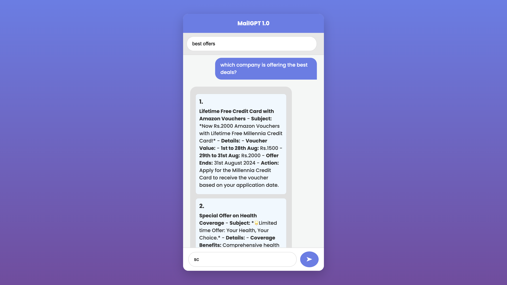
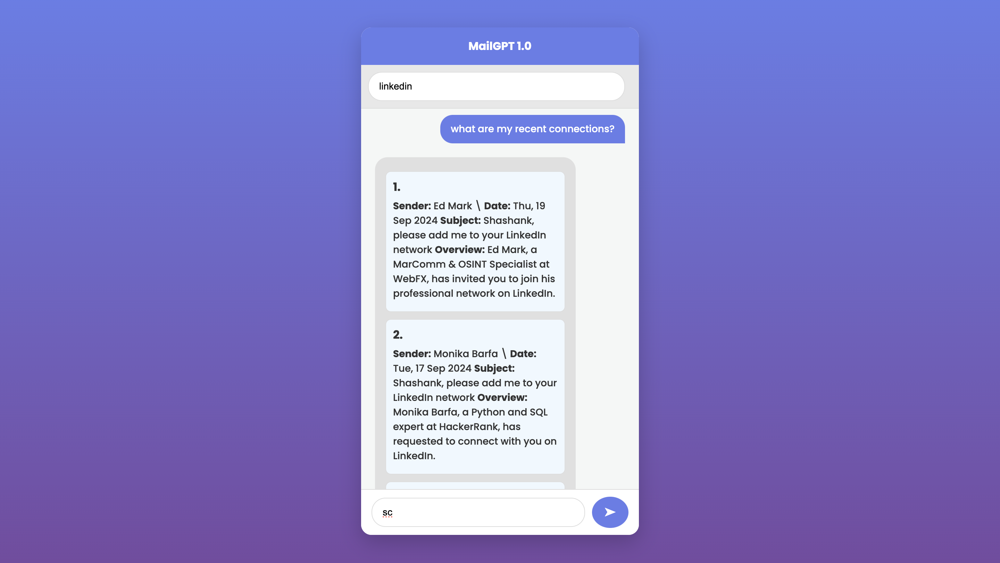

# MailGPT - Talking to your emails

MailGPT transforms your email experience into an interactive conversation. Chat with your inbox, ask questions, and uncover insights in a fun and engaging way. Say goodbye to inbox overwhelm and hello to effortless email management!

Feel free to tweak any part of it to better match your way!

## Table of Contents

- [Project Overview](#project-overview)
- [Features](#features)
- [Installation](#installation)
- [Usage](#usage)
- [Examples](#examples)
- [Contributing](#contributing)
- [License](#license)

## Project Overview

With MailGPT, you can easily navigate your emails, receive tailored responses, and gain valuable insights—all through a user-friendly chatbot interface.

-  Discover the exclusive deals you qualify for, so you can save money on things you actually want.
- Easily spot those annoying newsletters that clutter your inbox, helping you keep things tidy.
- See how much you’re spending and investing, giving you a clearer picture of your finances.
- Reveal valuable information in your emails that can help you make better decisions in your everyday life.

## Features

- **Relevant Mail Citing**: MailGPT cites the right emails when you need them, making your conversations more meaningful.
- **Scalable**: It effortlessly handles thousands of emails, ensuring smooth performance no matter how full your inbox gets.
- **Cost Efficient**: By focusing on the most relevant information, MailGPT keeps costs down while still delivering valuable insights tailored to your needs.

## Installation

### Step 1: Install Python 3.9

Download and install Python 3 from the official [Python website](https://www.python.org/downloads/release/python-390/).

### Step 2: Install Dependencies
 - Install all the dependencies using requirement.txt
 `pip install -r requirements.txt`

## Usage

### Running the Tool

Once the environment is set up, you can run MailGPT by providing a .mbox file dump:

- Dump you .mbox file (prolly taken from google takeout) in source folder with name `sample.mbox`
- Run the below python script to convert `.mbox` file to `.json`
```bash
python3 mbox_to_json.py
```
- Then start the server by running below python script
```bash
python3 post.py
```
- You can access MailGPT over `http://127.0.0.1:5000`

## Examples

Below are some examples of how to query MailGPT:

```markdown
## Section 1: Best Offers

- Add `best offers` in the topic
- Query - `Which company is offering the best deals?`
```


```markdown
## Section 1: Spammy Emails

- Add `linkedin` in the topic
- Query - `What are my recent connections?`
```


---

## Contributing

Contributions are welcome! Please submit a pull request or open an issue for any bugs or feature requests.

## License

This project is licensed under the MIT License - see the [LICENSE](LICENSE) file for details.