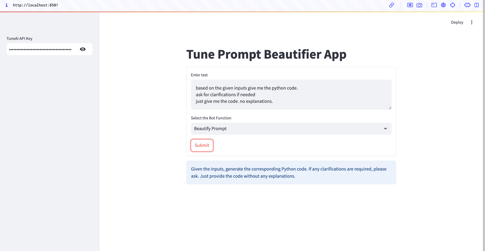

# Tune Prompt Beautifier App using TuneAI and Streamlit

This repository contains the code for building a prompt beautifier app that uses TuneAI to integrate LangChain with the OpenAI GPT-4 model and Streamlit for the front end.

The app allows users to either beautify an existing AI chat prompt or generate a new prompt based on a description. It leverages the TuneAI API to interact with a custom GPT-4 model for enhanced prompt generation.



## Running the Application

Clone this repository and navigate to the project folder. In this folder, run the following command to create a virtual environment:

```sh
python -m venv venv
```

Activate the virtual environment with the following command: 

```sh
source venv/bin/activate
```

Inside the virtual environment, install the required dependencies: 

```sh
pip install langchain langchain-openai streamlit
```

Start the app by running the following command: 

```sh
streamlit run app.py
```

The StreamLit app will launch in your browser. 
You can now enter your TuneAI API key and interact with the beautifier app. 