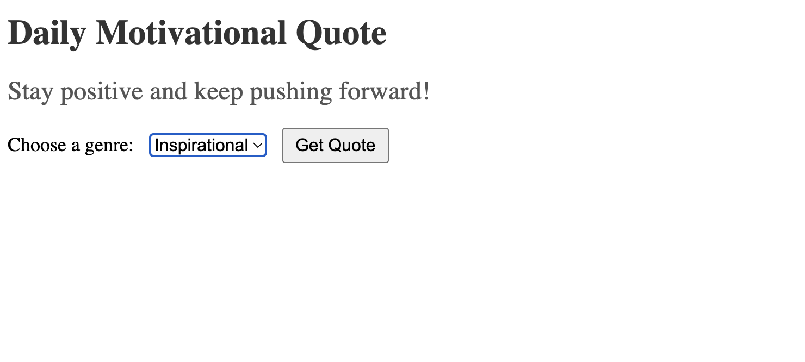

# Motivational Quotes API

A simple web application that provides daily motivational quotes from movies, books, and inspirational sources. Users can choose the genre, or default to inspirational quotes.

## Features

- **API Endpoint**: Fetch quotes based on genre.
- **Frontend**: Simple HTML page to display quotes and select genres.
- **Extensible**: Easily add more quotes or genres.

## Requirements

- Python 3.6 or higher
- Flask

## Installation

### Clone the Repository

```bash
git clone https://github.com/yourusername/motivational-quotes-api.git
cd motivational-quotes-api
```

### Create a Virtual Environment (Optional)

```bash
python3 -m venv venv
source venv/bin/activate   # On Windows: venv\Scripts\activate
```

### Install Dependencies

```bash
pip install -r requirements.txt
```

*Create a `requirements.txt` file with the following content:*

```
Flask
```

## Usage

### Run the Application

```bash
python app.py
```

The application will start on `http://127.0.0.1:5000/`.

### Access the Frontend

Open your web browser and navigate to `http://127.0.0.1:5000/` to view the motivational quotes.

### API Endpoint

Fetch quotes directly via the API:

- **Endpoint:** `/api/quote`
- **Method:** `GET`
- **Parameters:**
  - `genre` (optional): Genre of the quote (`inspirational`, `movies`, `books`). Defaults to `inspirational`.

**Example:**

```http
GET http://127.0.0.1:5000/api/quote?genre=movies
```

**Response:**

```json
{
  "quote": "Every moment is a fresh beginning."
}
```

**Example View:**


## Quotes are generate from LAMA 3 Model using Tune studio API's

You can see the interanl implementation in app.py

## Make sure to create an API key and Model using tunestudio you can refer thier help doct on how to do it 

Help docs lik -- > <https://studio.tune.app/docs/getting-started/introduction>

**Note:** Ensure that you have the rights to use any quotes added.

## License

This project is licensed under the MIT License.

## Acknowledgments

- Inspired by the desire to motivate and inspire users daily.
```

---

### **Step 6: Run and Test the Application**

Now, let's run the application and see it in action.

#### **Run the Application**

```bash
python app.py
```

You should see output similar to:

```
 * Serving Flask app "app" (lazy loading)
 * Environment: production
   WARNING: Do not use the development server in a production environment.
   Use a production WSGI server instead.
 * Debug mode: on
 * Running on http://127.0.0.1:5000/ (Press CTRL+C to quit)
 * Restarting with stat
 * Debugger is active!
 * Debugger PIN: 123-456-789
```

#### **Test the Frontend**

Open your web browser and navigate to `http://127.0.0.1:5000/`. You should see the motivational quote displayed, and you can select different genres using the dropdown menu.

#### **Test the API Endpoint**

You can test the API endpoint using a tool like `curl` or Postman.

**Using `curl`:**

```bash
curl http://127.0.0.1:5000/api/quote?genre=books
```

---

### **Additional Notes**

#### **Extending the Application**

- **Add More Genres:** Expand Th selection in index.html to add more generes
- **User Interface Enhancements:** Improve the frontend with better styling or use a frontend framework like React or Vue.js.
- **Caching:** Implement caching mechanisms to improve performance.

#### **Deployment**

- **Local Deployment:** Continue to run the app locally using Flask's development server.
- **Production Deployment:** For production, use a WSGI server like Gunicorn or uWSGI.
- **Cloud Deployment:** Deploy your app to cloud platforms like Heroku, AWS Elastic Beanstalk, or Google App Engine.

---

### **Need Further Assistance?**

Let me know if you have any questions or need help with:

- Adjusting the code
- Deploying the application
- Enhancing features
- Troubleshooting issues

I'm here to help!
