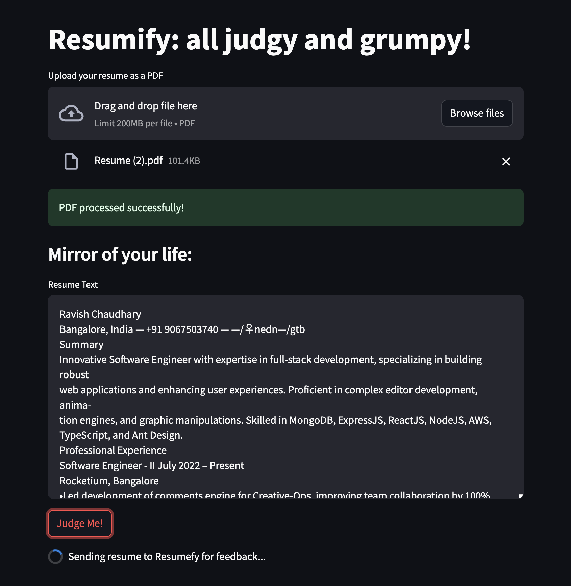

# 🎯 Resumefy: all judgy and grumpy!

## Overview

Welcome to the **Resumefy** app! This project is a powerful, AI-driven application that uses **TuneStudio's** language model API to review resumes, provide feedback, and answer follow-up questions. By uploading your resume in PDF format, the app will:
1. Extract and parse the resume text.
2. Send the parsed content to TuneStudio's AI model for analysis and feedback.
3. Display feedback that includes recommendations for improvement.
4. Offer prefilled prompts to ask additional questions or allow custom follow-ups to improve your resume further.

This solution is ideal for job seekers, professionals looking to fine-tune their resumes, or anyone interested in receiving tailored feedback from a state-of-the-art AI model.

---

## 🛠️ Key Features

- **Easy PDF Upload**: Users can simply upload their resume in PDF format to start the review process.
- **AI-Powered Feedback**: Leverages the TuneStudio API to analyze and provide constructive feedback on resume structure, content, and formatting.
- **Follow-up Interaction**: Offers both prefilled suggestions and the ability to ask custom follow-up questions about the resume.
- **Streamlit Interface**: A simple, intuitive, and responsive user interface for easy interaction with the AI.

---

## 📷 Screenshots

### 1. Resume Upload Process

> **Step 1**: Upload your resume as a PDF file to begin the review process.

---

### 2. Feedback from AI

> **Step 2**: The AI reviews your resume and provides detailed feedback. This includes suggestions on how to improve various aspects of your resume, such as formatting, skills presentation, and overall content.

---

### 3. Follow-up Recommendations

> **Step 3**: You can engage with the AI further by asking follow-up questions. We offer prefilled suggestions, or you can submit your custom questions for a more personalized experience.

---

## 🚀 How It Works

1. **Upload the Resume**: Users upload their resume in PDF format via the Streamlit app.
2. **PDF Parsing**: The app extracts the text from the uploaded resume using `PyPDF2`.
3. **TuneStudio API Integration**: The parsed resume text is sent to TuneStudio's model (`lamina/Test`), which reviews the content and returns feedback.
4. **Receive Feedback**: The feedback is displayed in the app. This feedback includes suggestions for improving your resume’s format, structure, and content.
5. **Follow-up Interaction**: After receiving the initial feedback, users can select from prefilled follow-up prompts or ask custom questions to get deeper insights into their resume.

---

## 💡 Use Cases

- **Job Seekers**: Get actionable insights to fine-tune your resume and increase your chances of standing out in a competitive job market.
- **Professionals**: Looking to advance in your career? Use the AI feedback to polish your resume and showcase your skills better.
- **Career Coaches**: Automate part of your resume review process by integrating this tool to get immediate feedback for your clients.
- **Recruiters**: Use this tool to quickly evaluate and provide feedback on potential candidates' resumes.

---

## 🔧 Installation & Setup

1. Clone this repository:
   ```bash
   git clone https://github.com/freakpirate/cookbook.git
   ```
2. Install the required dependencies:
   ```bash
   pip install streamlit requests PyPDF2
   ```
3. Add your TuneStudio API key:
   - Replace `YOUR_TUNESTUDIO_API_KEY` in the `resume_reviewer.py` file with your actual TuneStudio API key.
   
4. Run the Streamlit app:
   ```bash
   streamlit run resume_reviewer.py
   ```

5. Open your browser and go to the local URL provided by Streamlit to start interacting with the app.

---

## 📝 Example Flow

1. **Upload your resume**: Start by uploading your resume as a PDF file.
2. **Get initial feedback**: Once your resume is uploaded, the AI reviews it and provides detailed feedback.
3. **Ask further questions**: Use the prefilled prompts or ask your own follow-up questions to get additional insights.
4. **Improve your resume**: Apply the suggestions and feedback to create a standout resume.

---

## 🌟 Why Use This App?

- **Efficient Resume Review**: Automate the process of getting personalized resume feedback from an AI that has been fine-tuned for review tasks.
- **Interactive**: Engage with the AI through follow-up questions for deeper analysis and more comprehensive feedback.
- **Easy-to-use Interface**: Simple upload process and a user-friendly interface for a seamless experience.

---

## 💻 Tech Stack

- **Streamlit**: Provides the frontend interface for the application.
- **TuneStudio API**: Powers the AI-driven feedback using their language model.
- **PyPDF2**: Used for parsing and extracting text from uploaded PDF resumes.
- **Python**: Core language for the app logic.

---

## 🔑 License

This project is open-source and available under the [MIT License](LICENSE).

---

## 🎉 Contributions

Feel free to fork this repository and submit pull requests. Any ideas for improving the app or additional features are welcome!

---

## 🙋‍♂️ Contact

If you have any questions or feedback, feel free to open an issue or reach out via [email@domain.com](mailto:email@domain.com).

---

Give it a try and improve your resume today! 💼✨
