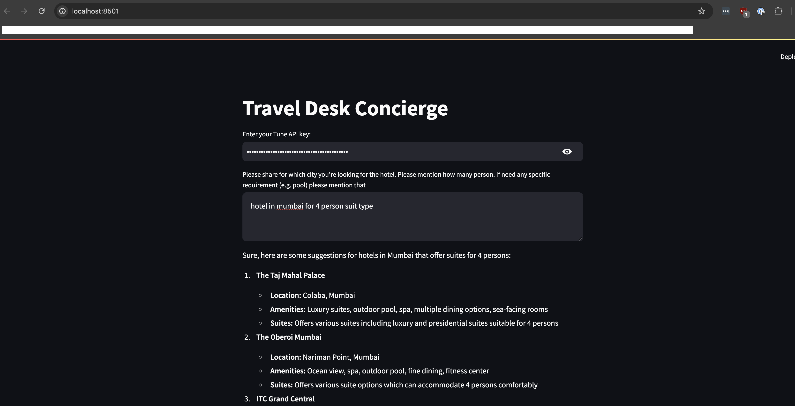

Travel Concierge App
====================

Welcome to the Travel Concierge App! This application leverages LangChain and Streamlit to help users find the perfect hotel for their travel needs. Built with the latest AI technology from Tune AI Studio, our app provides a seamless experience for travelers.

Features
--------

-   **Hotel Search**: Quickly find hotels based on your preferences.
-   **User-Friendly Interface**: Easy-to-navigate Streamlit interface.
-   **AI-Powered Recommendations**: Get personalized suggestions using LangChain.

Requirements
------------

Before running the app, ensure you have the following installed:

-   Python 3.9 or later
-   pip
-   tune api key

Installation
------------

`pip install -r requirements.txt`

Running the Tool
----------------

To start the Travel Concierge App, run the following command:

`streamlit run app.py`

This will launch the app in your web browser.

Future Development
------------------

We're excited about the future of the Travel Concierge App! Upcoming features include:

-   **Booking Facility**: Integrating with a booking API to allow users to book hotels directly through the app.
-   **Enhanced Search Filters**: More options for users to refine their search based on various criteria.
-   **User Accounts**: Allow users to create accounts to save preferences and past searches.
