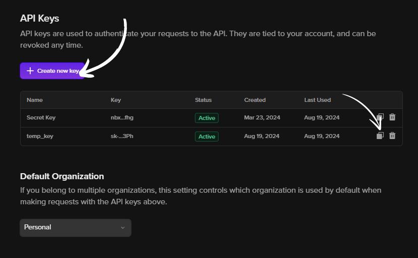

# Interview Simulator
[](https://)
[](https://www.python.org/)


This is a Streamlit Based Web Application that takes API Endpoints from Tune Studio to Simulate a Smart Interview Based on the number of questions, job description, and the difficulty of assessment.

## Implementation
Regarding the implementation, we have chosen [Streamlit](https://streamlit.io/) as the base of our operations, helping us tie up the outputs generated by the API calls to a chat interface. Unfortunately, the larger model asks for a higher VRAM, which I have chosen to fulfill using Tune Studio's API Calls.


For the upcoming code, here are some essential variables:
- `Conversation`: A session state variable holding all the conversation exchanges between the bot and the user.
- `Difficulty`: The difficulty of the simulated interview
- `API Key`: Your Tune Studio API Key
- `Max Questions`: Number of Questions in the Interview

### Generating Tune Studio API Key
Tune Studio comes with a bunch of free to use Opne Source and Closed Source LLMs, which can be easily accessed using their Application from `Personal > View API Keys`



### System Prompt
 While choosing the system prompt, we should be detailed with our requirements, as the model tends to meander and hallucinate if such instructions are not given.

The latest adversarial training on the modern Llama models also allows us to pass such a system prompt, avoiding any prompt leakage.

```
You are Boss Llama, an advanced AI interviewer. Your goal is to conduct a comprehensive and intelligent interview with the candidate based on the following details:

1. Job Description: {st.session_state.job_description}
2. Difficulty Level: {difficulty}
3. Number of Questions: {st.session_state.max_questions}

Instructions:
1. Start the Interview:
   - Begin by presenting a detailed job description for the role based on the difficulty level and the provided job description. Try to keep this introduction small and to the point as the user already knows what they are interviewing for.
   - Provide a warm welcome message to start the interview and set a positive tone.
2. Generate and Ask Questions:
   - Ask a series of questions, up to the specified number of questions. Ensure these questions are relevant to the job description and appropriately challenging according to the difficulty level.
   - Provide clear and concise prompts that assess the candidate's skills, knowledge, and fit for the role.

3. Conduct the Interview:
  - Engage with the candidate in a conversational manner. If the candidate's responses are vague or insufficient, let them know about it and give them a chance to improve, but count it as one more question.
   - Maintain a professional and supportive tone throughout the interview.
```

### Generating Responses
We will generate the responses and the conversation using a curl command from Tune Studio. The command is a simple way of linking your current working code with a model of your choice on Tune Studio, which holds an amazingly massive library of free models for inference and even more advanced models with custom fine-tuning and deploying practices for hard-core enthusiasts.

The variable "conversation," which incrementally holds the ongoing conversation, is called every time to create a response that adds to the existing discussion.

With parameters such as temperature, frequency_penaly, and max_tokens, we can also tweak the quality of responses, further enhancing the feeling of being interviewed by a proper interviewer.

```
# Function to call the API
def generate_response(conversation, apikey):
    url = "https://proxy.tune.app/chat/completions"
    headers = {
        "Authorization": apikey,  # Your API key
        "Content-Type": "application/json"
    }

    # Construct the payload for the API call
    payload = {
        "temperature": 0.9,
        "messages": conversation,
        "model": "meta/llama-3.1-70b-instruct",
        "stream": False,
        "frequency_penalty": 0.2,
        "max_tokens": 500
    }

    # Send the POST request to the API
    response = requests.post(url, headers=headers, data=json.dumps(payload))

    # Check if the request was successful
    if response.status_code == 200:
        # Extract the response from the JSON output
        return response.json()["choices"][0]["message"]["content"]
    else:
        return f"Error: {response.status_code} - {response.text}"
```
### Generate Evaluations
For the evaluations, we are using a similar API call. We only pass the individual exchanges from the bot and the user to run an assessment using a suitable system prompt.

This second call activates the interviewer's harsher and more intense side. This new call then looks at the conversation from a third perspective and assigns feedback and a score that feeds back into the web application.

```
# Function to generate evaluations on the interview
def generate_evaluation(question, answer, difficulty, apikey):
    url = "https://proxy.tune.app/chat/completions"
    headers = {
        "Authorization": apikey,
        "Content-Type": "application/json"
    }

    payload = {
        "temperature": 0.7,
        "messages": [
            {"role": "system", "content": f"Evaluate the following answer based on the job description difficulty level: {difficulty}."},
            {"role": "user", "content": f"Question: {question}\nAnswer: {answer}"}
        ],
        "model": "meta/llama-3.1-70b-instruct",
        "stream": False,
        "frequency_penalty": 0.2,
        "max_tokens": 500
    }

    try:
        response = requests.post(url, headers=headers, data=json.dumps(payload))
        response.raise_for_status()
        result = response.json()
        feedback = result.get("choices", [{}])[0].get("message", {}).get("content", "No feedback provided")
        score = result.get("choices", [{}])[0].get("score", 0)
        return feedback, score
    except requests.RequestException as e:
        return f"Error: {e}", 0
```
### Download PDF Report
FPDF, initially a PHP class, is a library used for PDF document generation under Python. Compared to other jargon available online, FPDF provides a more streamlined and straightforward way to generate PDFs. (It also allows us to add PNGs, JPEGs, and GIFs to the PDF, which should be a boon if we wish to add systems to include tacky diagrams in the report.)

```
# Function to generate a PDF report
def generate_pdf_report(evaluations):
    pdf = FPDF()
    pdf.add_page()
    pdf.set_font("Arial", size=12)
    
    pdf.cell(0, 10, "Interview Evaluation Report", ln=True, align="C")
    pdf.ln(10)  # Add a line break
    
    for evaluation in evaluations:
        pdf.set_font("Arial", style='B', size=12)
        pdf.multi_cell(0, 10, evaluation["Question"])
        pdf.set_font("Arial", size=12)
        pdf.multi_cell(0, 10, evaluation["Answer"])
        pdf.multi_cell(0, 10, f"Feedback: {evaluation['Feedback']}")
        pdf.multi_cell(0, 10, f"Score: {evaluation['Score']}")
        pdf.ln(5)  # Add a line break

    # Save the PDF to a temporary file
    temp_file = tempfile.NamedTemporaryFile(delete=False, suffix=".pdf")
    pdf.output(temp_file.name)
    return temp_file.name
```
## Repository Structure
- `app.py`: Holds Streamlit UI
- `utils.py`: Holds functions for Generating Responses, Generating Evaluations and Generating the PDF

## Further Reading
- [Llama 3.1 Integration with Tune Studio](https://tunehq.ai/blog/tune-ai-integrates-latest-llama-3-1)
- [Finetuning on Tune Studio](https://tunehq.ai/blog/finetuning-llms)
