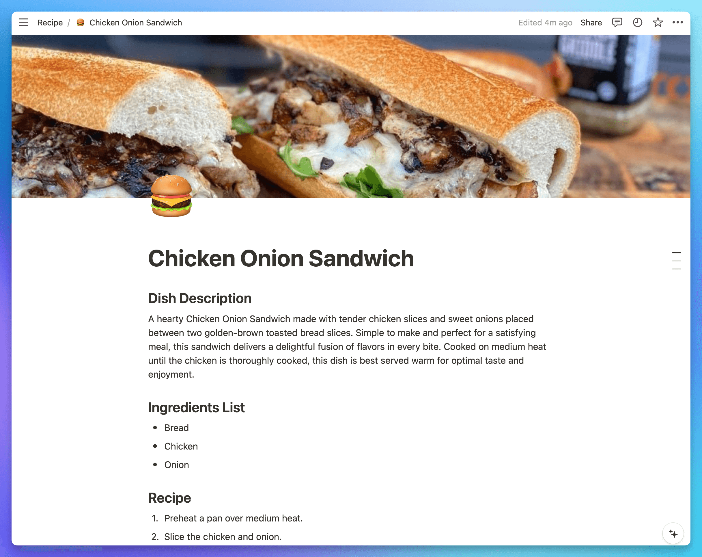

# Recipe Generator in Python using Notion and Tune Studio
## Project Description
In this project, the user will enter the ingredients from which they want a recipe to be generated using the CLI. The user-entered ingredients will then be passed to the LLM, which will generate the recipe title, recipe description, ingredient list, and recipe steps. The user will be able to see the generated recipe in Notion, along with a suitable emoji and cover image for the recipe. To generate a cover image for the recipe, Serper Search Image API is used.

Following is an example output of this project.

CLI command:
```
python main.py --topic='give me a recipe using bread, chicken, onion' \
  --page_id=<your-notion-page-id> \
  --model=rohan/mixtral-8x7b-inst-v0-1-32k
```

Notion Output:


---
Demo: 


https://github.com/AsavariD/cookbook/assets/69451908/366359fe-0a57-4041-a6a2-2d8311e08e4e


## Installation
To install the dependencies in the requirements.txt file run the following command:
```
pip install -r requirements.txt
```

## Environment variables
Set the environment variables in a `.env` file
```
NOTION_KEY = <your-notion-api-key>
TUNEAI_API_KEY = <your-tuneai-api-key>
SERPER_KEY = <your-serper-api-key>
```

## Functions
- `call_llm`: Function to call the LLM API with a specific `messages` parameter and return the response content.

- `gen_recipe`: Function to generate a recipe based on `dish_title`, `ingredients` and `num_ingredients`.

- `gen_recipe_title`: Function to generate a recipe title based on `topic` which is the content entered by the user.

- `gen_num_ingredients`: Function to count the number of ingredients entered by the user in `topic`.

- `gen_ingredient_list`: Function to create an ingredients list based on `topic` entered by the user.

- `gen_description`: Function to generate a description for the recipe using `dish_title`, `ingredients` and `recipe`.

- `gen_cover_image`: Function to create a cover image for the Notion page of the recipe using `dish_title` and the Serper Image Search API.

- `gen_emoji`: Function to generate an emoji icon for the recipe using `dish_title`.
