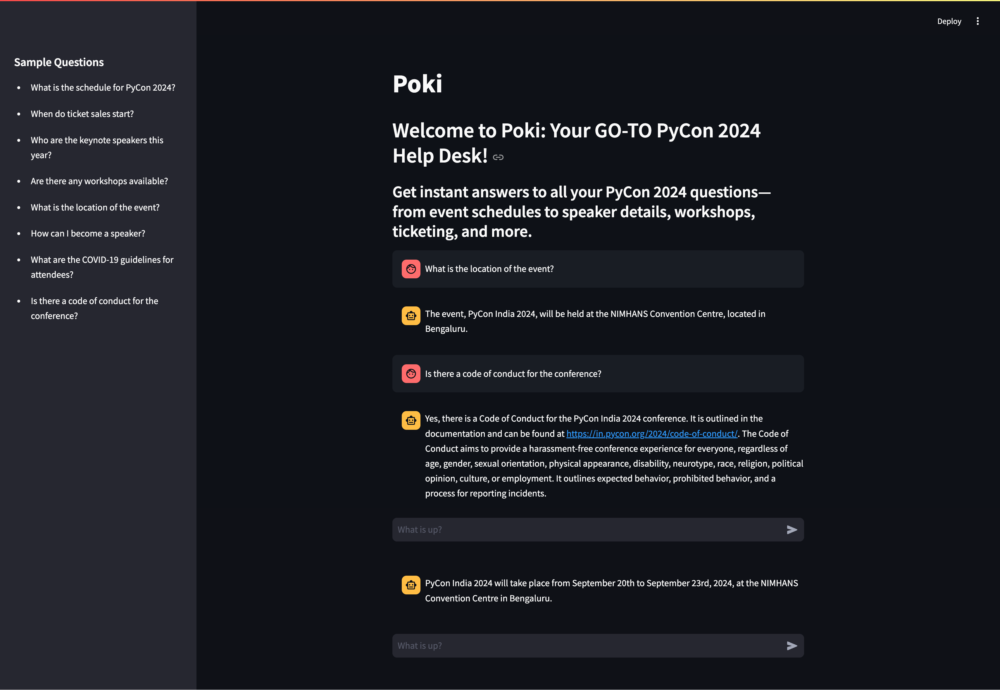
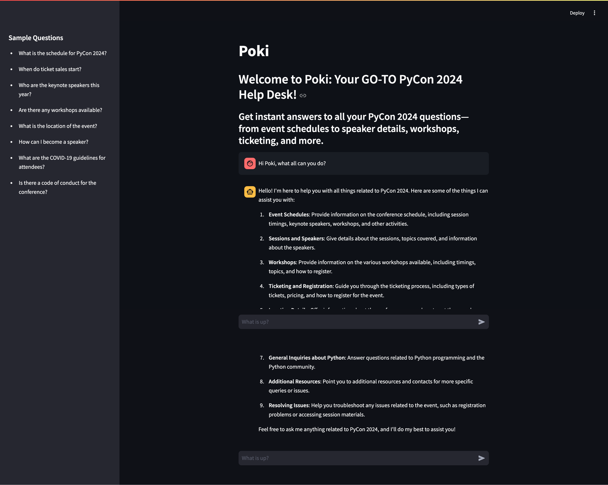

# Poki: Your GO-TO Guide for PyCon24

## Overview

Welcome to the **PyCon 2024 Assistant**! This Streamlit app, named **Poki**, is designed to help attendees and potential participants get quick and accurate information about the upcoming PyCon 2024 conference. Whether you have questions about the schedule, ticketing, speakers, or workshops, Poki is here to assist you!

## Features

- **User-Friendly Interface**: Simple and intuitive design for easy navigation.
- **Instant Responses**: Get quick answers to common queries about PyCon 2024.
- **Sample Questions**: A list of sample questions to guide users in formulating their queries.
- **Helpful Links**: Direct users to the official PyCon 2024 website for more detailed information.

## Getting Started

To run the PyCon 2024 Assistant locally, follow these steps:

### Prerequisites

- Python 3.7 or higher
- Streamlit library

1. Go to the repository:
   ```bash
    cd poki_friendly_pycon_guide
   ```
2. Install dependencies
To install the dependencies in the requirements.txt file run the following command:

    ```sh
    pip install -r poki/requirements.txt
    ```

3. Environment Variables
Before running the app, you need to set up some environment variables. In your poki folder, create a .env file and add the following:

    ```makefile
    TUNEAI_API_KEY=<your-tune-api-key>
    SUPABASE_URL=<your-supabase-project-url>
    SUPABASE_KEY=<your-supabase-project-key>
    OPENAI_API_KEY=<your-openai-api-key>
    ```
4. Running the App
To start the Streamlit app, run:

    ```bash
    streamlit run poki/app.py
    ```
Open your web browser and go to http://localhost:8501 to interact with Poki!

### Screenshots


